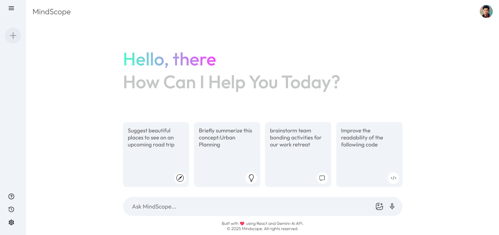

# 🔍 Mindscope AI Search

An **AI-powered search assistant** built with React and integrated with **Google’s Gemini API** for contextual understanding and smart responses.

---

## 🚀 Live Demo  
🔗 [View Live](https://mindscopeaisearch.vercel.app/)  

---

## 🛠 Tech Stack  
  
  

---

## ✨ Features  
- 🤖 AI-powered contextual answers  
- 📝 Search history tracking  
- 💨 Fast and lightweight UI  

---

## 📸 Screenshots  
  

---
